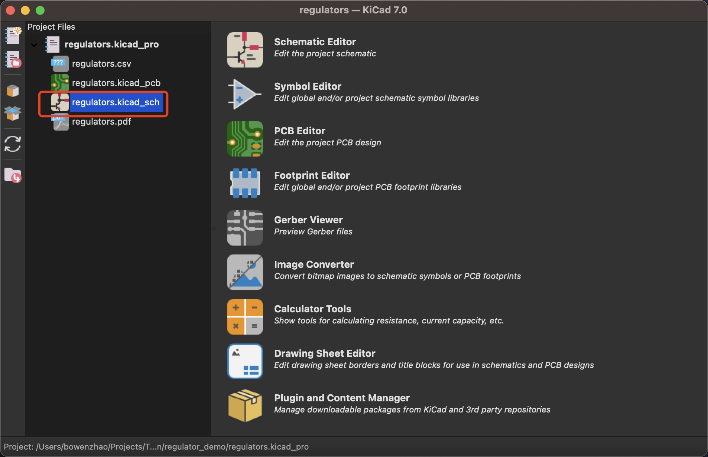
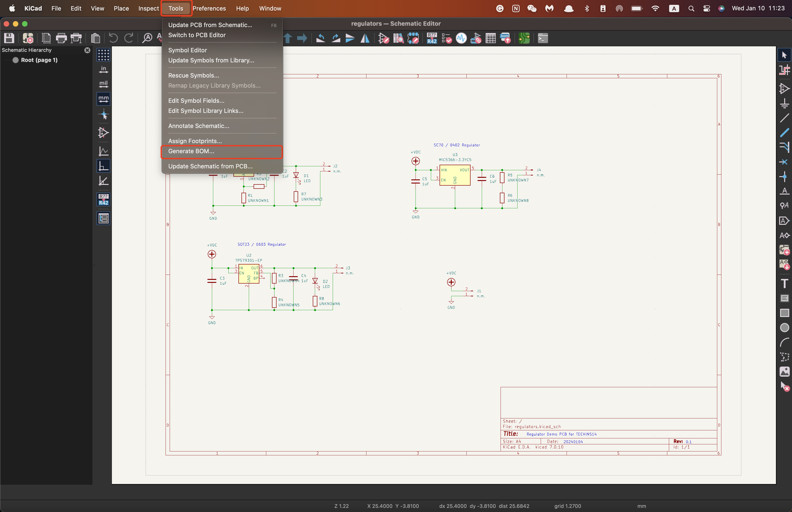
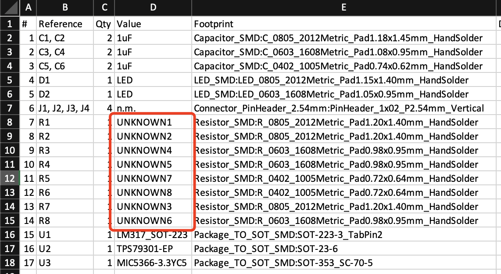
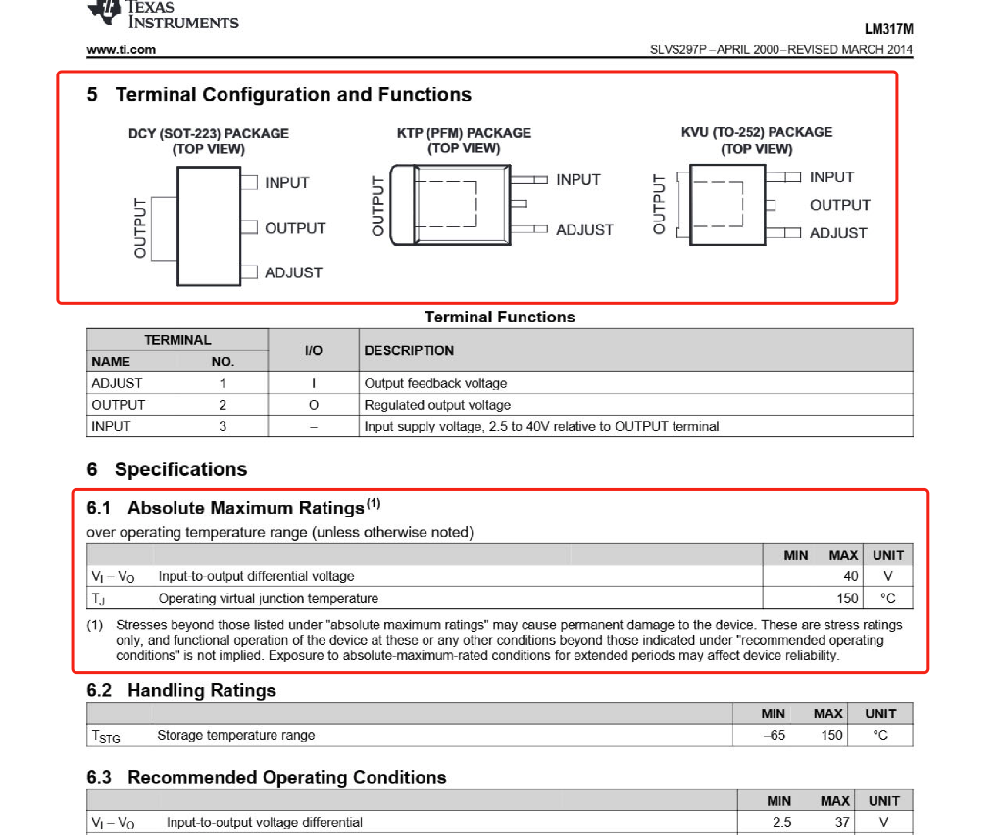
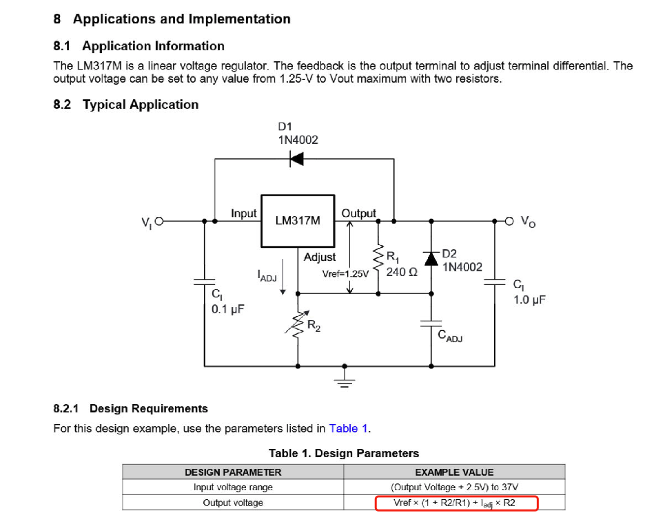

## Lab 2: Component Selection and Surface Mount Soldering

**This lab has two sections: analytical and physical**

## Lab Prerequisites

Before this lab, make sure you have the following ready:

* KiCAD installation on your laptop for PCB design
* **USB-C cable**: Make sure you can connect ESP32 to your laptop

## Section 1: analyse and component selection

The first part is analytical, using the regulators schamtic.

Step 1: Geneate a BOM using KiCAD and save to a CSV

1. Open the file *regulators.kicad_pro* with KiCAD, and double-click the _sch tab

   
2. Then click Tool -> Generate BOM to generate the spreadsheet:

   
3. Select *bom_csv_grouped_extra* on the left then click *Generate
   *
4. The file should appear under the same directory as the schematic file, showing on the screen
   
5. Open the CSV file, and fill in all UNKNOWN values based on your calculation mentioned below:
   

Step 2: Datasheet reading, calculation, and component selection

* You'll choose the necessary resistors to adjust output voltage of your regulators and a matching current-limiting resistors for your LEDs.
  * For your regulators, set the first output voltage (VOUT1, on the left) to 2V + 0.01 * the day of the month you were born. So if you were born on the 15th, you should set the voltage to 2.15V;
  * For the second output voltage (VOUT2, in the middle), add 0.1 to the first output voltage. So if you were born on the 15th, set it to 2.25V;
  * For the third output voltage (VOUT3, on the right), set it to the same voltage as VOUT2.

Here's a brief instruction about how to read a datasheet, using the LM317 regulator as an example:

1. Check the Terminal Configuration and Functions to know what pins are for on this device;
2. Check the Speficiations (Specs), especially Absolute Maximum Ratings of the device. This will ensure you won't destroy the device with high voltage/current;
   
3. For regulators, there will be a section of *Application and Implementation* to demonstrate how to assemble it with resistors and capacitors. Typically, there should be an equation about how the output voltage is set: **the selection of the resistors will affect the output voltage**, and this is what your calculation should aim for
   

    There could be other details on the datasheet that might help your component selection. Please check them out carefully.

**For circuits with LEDs and resistors in serial, make sure you select a suitable resistor that will make the current forward (If) in a suitable range.**

The second part is physical, the goal here is to be familiar with the component packages you might be using in your designs.

- Assemble the board with your chosen resistor values, verify with the multimeter that you have correct output voltage or that your board is non-functional.  Connect to the analog pin of an ESP32 and read the voltage.
- AFTER checking them with the multimeter, you are going to attach your ESP32 to the outputs and read the voltage using an analog input pin.
- Some boards will be non-functional.  try to debug and fix it if you want.  but its OK if you read zero volts to your ESP32.
